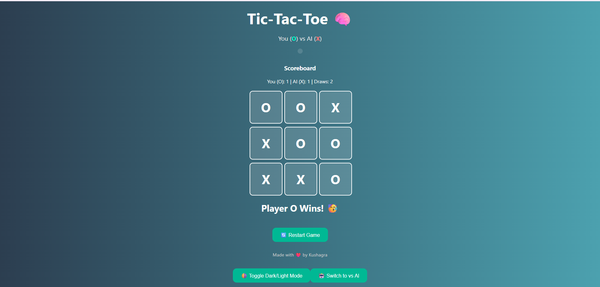

# 🎮 Tic-Tac-Toe AI Web App

An interactive and intelligent Tic-Tac-Toe game built with Python (Flask) and JavaScript.  
Play against an **unbeatable AI** (powered by Minimax algorithm) or challenge your friend in **Player vs Player mode**!

> 💡 This project was built as part of the **CodeSoft Internship Task-2**.

---

## 🌟 Features

- 🤖 **AI Mode** using Minimax (Never loses)
- 👬 **Player vs Player** mode toggle
- 📊 **Scoreboard** to track wins/draws
- 🌗 **Dark/Light Mode** toggle
- 🔊 **Sound Effects** on moves
- 🎉 **Win Animation** on game end
- 💻 Responsive Web Interface (Clean UI)

---

## 🧰 Tech Stack

| Frontend         | Backend        | AI Logic      |
|------------------|----------------|---------------|
| HTML, CSS, JS     | Python (Flask) | Minimax Algorithm (No ML) |

---

## Web app
   [App]  https://tic-tac-toe-yo86.onrender.com

---
## 📸 Screenshots

> (Add your screenshots in the `screenshots/` folder and update these paths.)




---
## 📫 Let's Connect:
[LinkedIn] www.linkedin.com/in/kushagra-singh-b86695297 | [GitHub] https://github.com/Kushagra54321

## 🚀 Getting Started (Local Development)

### 1. Clone the repository
```bash
git clone https://github.com/kushagra54321/CodeSoft_tic_tac_toe_game.git

2. Install dependencies
Make sure Python 3.8+ is installed.

bash
Copy
Edit
pip install flask
3. Run the app
bash
Copy
Edit
python app.py

